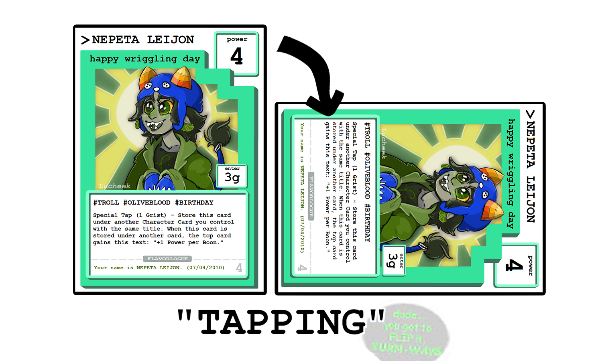
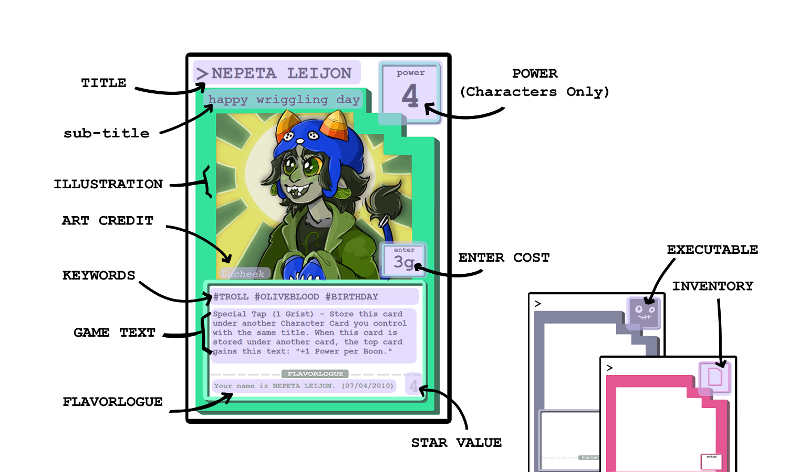

**Warning: Not Up-to-Date with TTS 10/10/2023 Release!!**

I'm working on updating terminology, but the concepts are the same.

Rule Book Build: Pre-Alpha Play-Test 0.2 (Updated: June 27, 2023)

## Basic Concepts
The game consists of 2 to 5 players competing against each other to be the single winner. The winner is decided by the player with the most <abbr>Victory Points</abbr> at the end of the game. Each player will have a <abbr>Main Deck</abbr> that consists of 48 cards, and a single, additional special Planet Card. Players assemble their deck before the game begins.

Players take <abbr>turns</abbr> being the Active Player. A turn consists of multiple <abbr>phases</abbr>. After the final phase of an Active Player's turn, the next player takes a turn. After every player has had a turn, a new <abbr>Round</abbr> begins- and each player takes another turn. The rounds continue until a player reaches 7 Victory Points, which triggers <abbr>End Game</abbr>. During End Game, every other player takes one more turn, and then the game ends and a winner is decided.

To earn Victory Points, a player must have more <abbr>Power</abbr> at an opposing player's location at the end of a turn. Players choose to either put their <abbr>Character Cards</abbr> (cards with a Power value) at their own location, to prevent opposing players from scoring Victory Points there, or at another player's location to score Victory Points themselves.

During an Active Player's turn, the player has a limited amount of actions they can perform. The amount of actions they take is determined by the player's current Grist. Performing actions costs a certain amount of <abbr>Grist</abbr>, which replenishes at the beginning of the player's turn. A player can also choose to save their Grist up between multiple turns, declaring an end to their turn before all their Grist is spent.

A common action a player can take is to <abbr>Tap</abbr> their character card. When a card is tapped, it is physically rotated 90 degrees to the right (clearly indicating the card has been tapped, and can't be tapped again.) Tapping costs 1 Grist. When a character card is tapped by the active player, all other player's character cards with less power at the same location of the tapped card are <abbr>destroyed</abbr>. Destroyed cards go to their player's discard pile, and do not count as having power at any location.

At the end of a player's Main Phase, any character cards at their own planet's location that have not been tapped, collect one <abbr>Boon</abbr>. Boons are special markers that can be spent to activate special actions, or give unique bonuses to a character card. Character Cards only earn boons at their own player's planet's location and only if they are untapped that turn. A Character Card can only have a maximum of 3 Boons.

## The Cards
There are 3 types of cards in a player's Main Deck: Character Cards, Inventory Cards, and Executables Cards. These cards are single-sided. The common traits between all card types in the main deck are a Title, Subtitle, Enter Cost, Artwork and Art Credit, and FlavorLogue.

The "name" of a Card is both it's <abbr>Title</abbr>, written in all-capital letters, and it's <abbr>Sub-Title</abbr>, written in all lower-case letters. Different cards can have the same Title, but different Sub-Titles. When any card's effect references a card's title, any card with that title (even with different sub-titles) is valid for that effect!

A card's <abbr>Enter Cost</abbr> is what it takes to move that card from your hand onto the field. (The exact location a card will enter on the field is determined by the type of card.) Most of the time, Enter Cost is a certain amount of Grist that the player must spend. Sometimes, the Enter Cost is a unique trigger- such as the destruction of certain titles of other cards. The Enter Cost must always be resolved in-full, before the card becomes active on the field. Once a card is on the field, it does not need to pay the Enter Cost again (such as to move locations on the field.) The only time you need to pay the Enter Cost is when the card moves from your hand to the field.

Every card has <abbr>Artwork</abbr> and <abbr>FlavorLogue</abbr>- an illustration and a little bit of text to add flair and character to the card. These are not used in the game's mechanics, but can add a little joy. The <abbr>Art Credit</abbr> is a note of who created the featured artwork!

<abbr>Character Cards</abbr> are cards that have <abbr>Power</abbr>. A character's card power can contribute to an invading force at a different location, or the defending force of their own player's planet.

Character Cards also have <abbr>Keywords</abbr>, written as hashtags. Keywords are, on their own, mechanically unimportant- but other cards can reference keywords for special effects. Only keywords written on the card are valid, even if a keyword might hypothetically apply to a Character Card's character. (For example: If a card titled KARKAT VANTAS does not have the printed keyword #troll, effects that refer to #troll cards do not apply to that card- even if Karkat, the character, is a troll.)

While all character cards can be tapped for 1 Grist to destroy character cards with less power at that location, some character cards can also have a <abbr>Special</abbr> Tap effect. Special Tapping still rotates a Character Card and is considered tapping the card (and thus only able to be used once until the card is refreshed)- but will trigger different effects, and have a different cost. If a card is available to be special tapped, the cost and effects of that special tap will be written on the card.

Character Cards who receive bonuses for having <abbr>Boons</abbr>- accrued for having an untapped card at your home location at the end of your turn- will have the bonuses noted. Otherwise, boons do not effect a card. A Character Card can have a maximum of 3 Boons on it, and if it were to move in any way, looses all it's current boons.

<abbr>Inventory Cards</abbr> are cards that are attached to another card- usually a character card or planet, and then provide additional effects or bonuses to the card they attached to. When a character card moves, any attached inventory cards will move with them.

<abbr>Executable Cards</abbr> are played face-up near a player's own planet's location, but are not considered attached to the planet or location. Executable Cards have ~ATH ("Tilde-ath") Code associated with them. This means they have a special effect that is triggered only after the card is active on the field, and then a specific type of card is discarded.

For instance, an Executable Card that says "~ATH: any #TROLL character card. Execute: Draw 3 Cards" would mean that, if after this executable card is put onto the field by paying it's Enter Cost, if any #troll character card is put in the discard pile (destroyed), the player who controls this executable card will then draw 3 cards.

Executable Cards can only be triggered once their specific ~ATH card is put into the discard pile. Executable Cards are discarded themselves once their special effect is resolved. Executable Cards can be triggered during any player's turn! A single card reaching the discard pile can trigger multiple executable cards, if relevant to all conditions.

## Locations
Every player has a <abbr>Planet Card</abbr> that represents their own location. This Planet Card is double-sided-- with an active side, and a destroyed side on the back. Planet Cards never enter the Discard Pile, but can still trigger ~ATH code by being destroyed. Even when the Planet Card is destroyed, the player still has a "planet-location" where character cards can go. Cards a player controls at their own planet are considered defending, and cards they control at another player's planet are conisdered invading.

Players will also have their "personal locations"- their own hand, active executable cards, draw pile, discard pile, and "removed-from-play" pile. Other players can NOT add cards to any other player's personal locations, only their Planet / Planet Location. A player CAN chose to have a character enter play at another player's planet.

## Start Up
When you start a game, everybody rolls a dice simultaneously. The highest roll is the first active player, and the play continues clockwise. If multiple people tie, the others are removed, and the ties re-roll until there is a highest roll among them.

Every player will put their Planet Card, face-up, onto the table, and then draw 5 Cards into their hand. If a player wants to put these first 5 cards back, they may do so up to two times- each time shuffling their deck before drawing another 5 cards. This is called a "mulligan," and can only be done before the first active player's turn. Whenever a player mulligans, ever other player gians +1 Grist immediately.

After every player has 5 cards in their hand, and has resolved any mulligans, it's the first active player's turn.

## Active Player's Turn Reference
### PREP PHASE
Gain GRIST based on the current highest score amongst all players. (You can choose to save Grist up between turns- but you can never have more than 12 Grist!)

| Victory Points | Gain     |
|----------------|----------|
| 0              | 3 Grist  |
| 1-2            | 5 Grist  |
| 3-5            | 6 Grist  |
| 6+             | 9 Grist  | 

REFRESH any Tapped Character Card you Control

Draw 1 Card- if your Planet Card is not destroyed, you may also draw an additional amount of cards according to your Planet Card's Draw Attribute. Drawing additional cards is optional, but you must decide whether or not you'll take advantage of this effect when you draw. (You can not draw 1, and then decide to draw more later.)

If your Draw Pile is empty and you need to draw any amount of cards- shuffle your Discard Pile and move it to your Draw Pile. If you do, all other player's gain +2 Victory Points. This can happen during any phase or player's turn.

### MAIN PHASE
During the Main Phase, the Active Player can choose to activate and resolve as many of these effects as they desire and have Grist for, in any order.

- Pay the Enter Cost to play a card from their Hand
- Move a Character Card for 2 Grist- and then move-tap that card
- Tap a Character Card for 1 Grist to destroy other player's character cards with less power at the same location
- Special Tap a Character Card for the printed Special Tap Cost
- Resolve Effects of Taps and/or Passives (as needed.)
- All Players Check for Triggers, and Resolve Executable Cards as needed.  

The Main Phase ends when you have 0 Grist, or you declare it to end.

### SCORE PHASE
*The Score Phase is skipped until the first turn of the second round!*

The Power on Each Planet Location is Checked- Invaders with Higher Power (any player) score a Victory Point, and the Planet takes 1 Damage (if it's not destroyed already). If there are multiple invaders, multiple players can score points and cause damage to the same planet. The power is only checked against the Defenders, not other Invaders.

Any player who scores a Victory Point and has a destroyed planet, has their planet restored.

If any player now has 7 Victory Points,or more, the game enters End-Game- every other player takes one more turn and the game is over.

### BOON PHASE
Put Boons on your Untapped Cards on Your Planet (Active Player Only)

## Deck Building
A deck must always contain exactly one planet card and 48 other cards.

The total value of "stars" in a deck can not exceed 150.

There can never be more than 2 copies of the exact same card (title and sub-title) in a deck.